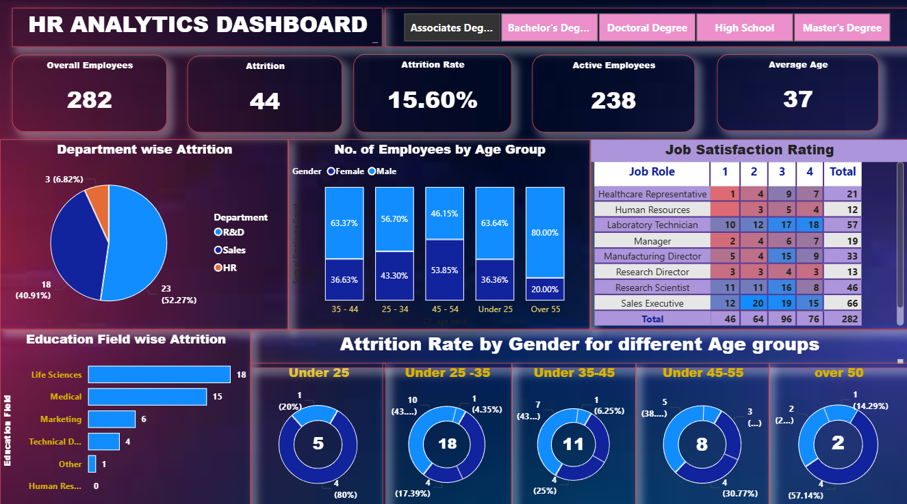
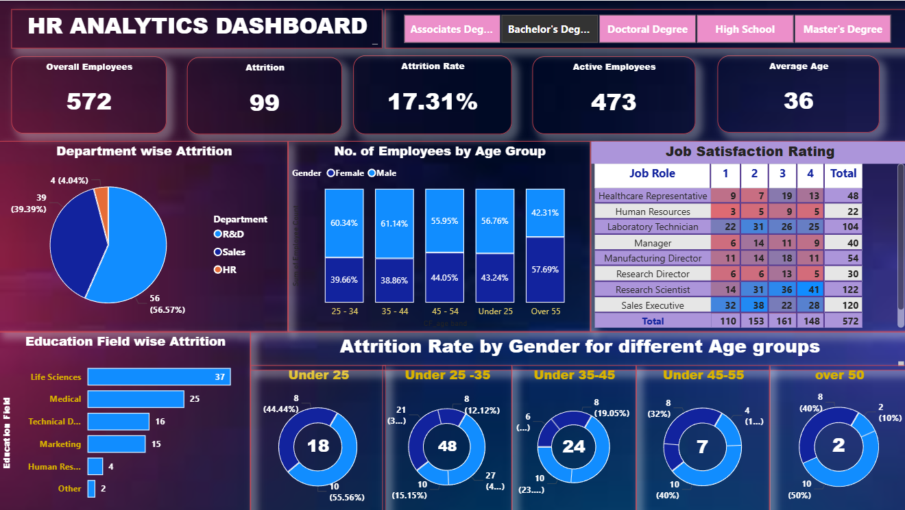
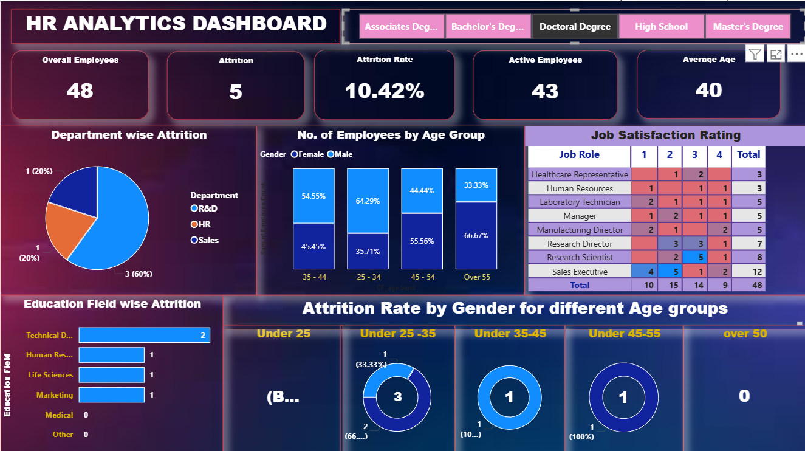
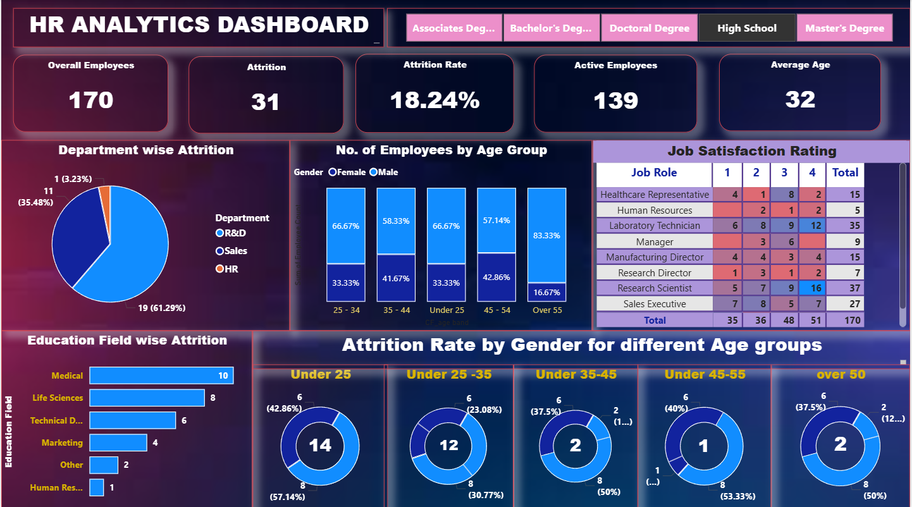
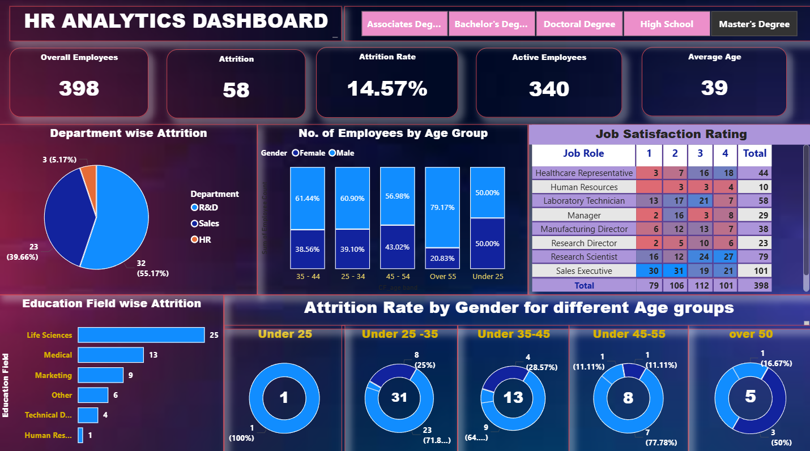

# HR-Analytics-Dashboard
An interactive Power BI dashboard that analyzes employee attrition, job satisfaction, and workforce demographics, with the ability to filter all visuals by education level (Associate's, Bachelor's, Doctoral, High School, and Master's degree).
# HR Analytics Dashboard

An interactive Power BI dashboard that analyzes employee attrition, job satisfaction, and workforce demographics, with the ability to filter all visuals by education level (Associate's, Bachelor's, Doctoral, High School, and Master's degree).

## Overview

This dashboard provides HR teams and decision-makers with a clear view of workforce attrition trends, helping identify which departments, age groups, education fields, and job roles are most affected by employee turnover. The education-level filter buttons at the top of the dashboard allow users to drill down into attrition patterns for each specific education category.

## Features

- **Key Metrics at a Glance**: Overall Employees, Attrition, Attrition Rate, Active Employees, and Average Age
- **Department-wise Attrition**: Pie chart breakdown of attrition by department (R&D, Sales, HR)
- **Employee Age Distribution**: Stacked bar chart of employees by age group and gender
- **Job Satisfaction Rating**: Matrix table showing satisfaction scores (1-4) across job roles
- **Education Field-wise Attrition**: Bar chart of attrition counts by education field
- **Attrition Rate by Gender and Age Group**: Donut charts segmenting attrition across five age bands (Under 25, 25-35, 35-45, 45-55, Over 50)
- **Education Level Filter**: Toggle buttons to view dashboard metrics filtered by Associate's, Bachelor's, Doctoral, High School, or Master's degree

## Dashboard Previews

### Associate's Degree


### Bachelor's Degree


### Doctoral Degree


### High School


### Master's Degree


## Repository Contents

| File | Description |
|------|--------------|
| `dashboard.pbix` | Power BI dashboard file (open with Power BI Desktop) |
| `hrdata.csv` | Source dataset used to build the dashboard |
| `images/` | Dashboard screenshots for each education-level filter view |

## 🚀 Getting Started

1. Clone this repository:
   ```bash
   git clone https://github.com/your-username/HR-Analytics-Dashboard.git
   ```
2. Open `dashboard.pbix` in [Power BI Desktop](https://powerbi.microsoft.com/desktop/) (free download).
3. Use the **Refresh** button in Power BI if you'd like to reload the data from `hrdata.csv`.
4. Click the education-level tabs at the top of the report to filter all visuals.

## Tools Used

- **Power BI Desktop** – data modeling, DAX measures, and visualization
- **CSV** – source HR employee dataset

## Insights Highlighted

- Attrition rate varies notably by education level, with High School employees showing the highest attrition rate (18.24%) and Master's degree holders the lowest (14.57%) among the groups shown.
- R&D consistently accounts for the largest share of attrition across most education levels.
- Younger employees (Under 25 and 25-35) tend to show higher attrition counts compared to older age bands.

---

## 📄 License

This project is open-source and available under the [MIT License](LICENSE).

---

## 👤 Author

**DIYA NEGI**  
📧 mailto://diyanegi875@gmail.com 
🔗 [LinkedIn](https://www.linkedin.com/in/diya-negi-4a0a4a347) | [GitHub](https://github.com/diyanegi976)

Feel free to open an issue or reach out if you have questions or suggestions!

---

⭐ **If you found this project helpful, please give it a star!**
